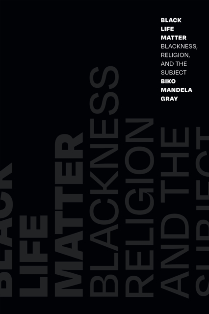

---
tags:
title: Home
draft: "false"
---
# Hi I'm Ngozi Harrison
 I am a PhD student at UCLA in the department of [Information Studies](https://seis.ucla.edu/academics/department-of-information-studies/) where I am advised by [Dr. Safiya Noble](https://safiyaunoble.com/)

My research is focused on the social aspects of mathematical knowledge, particularly the mathematics and computational methods behind AI, algorithms, and sociotechnical systems. I am interested in how mathematical methods and formalizations affect the algorithmic technologies we use everyday and my goal is to create just liberatory technologies.

My interests stretch across critical scholarship on technology, mathematics, and computational methods

This space is a place for my writings, class notes, and quick ideas as I work through my research.

# Current Reading

## Research

| Black Life Matter by Biko Mandela Gray | Frantz Fanon: Combat Breathing by Nigel C. Gibson | On the Existence of Digital Objects by Yuk Hui |
| -------------------------------------- | ------------------------------------------------- | ---------------------------------------------- |
|         |                     |   |

| Mathematics for Machine Learning by A. Aldo Faisal, Cheng Soon Ong, and Marc Peter Deisenroth |
| --------------------------------------------------------------------------------------------- |
|                                                  |
